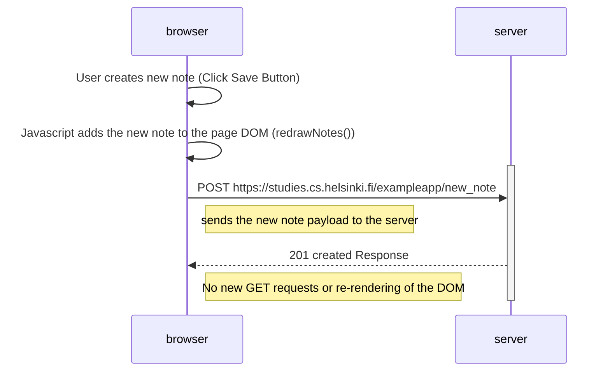

````
Adding new note in SPA - Action sequence diagram
````


```mermaid
sequenceDiagram
    participant browser
    participant server

    browser->>browser: User creates new note (Click Save Button)

    browser->>browser: Javascript adds the new note to the page DOM (redrawNotes())

    activate server
    browser->>server: POST https://studies.cs.helsinki.fi/exampleapp/new_note
    
    Note right of browser: sends the new note payload to the server

    server-->>browser: 201 created Response
    Note right of browser: No new GET requests or re-rendering of the DOM

    deactivate server

```